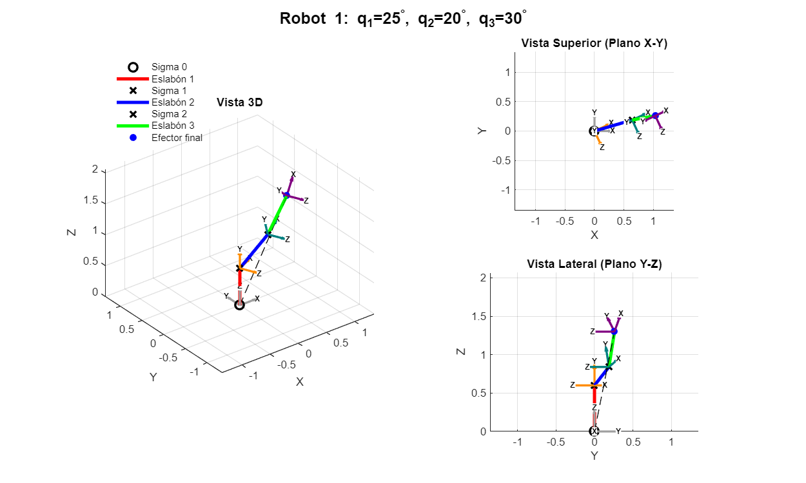
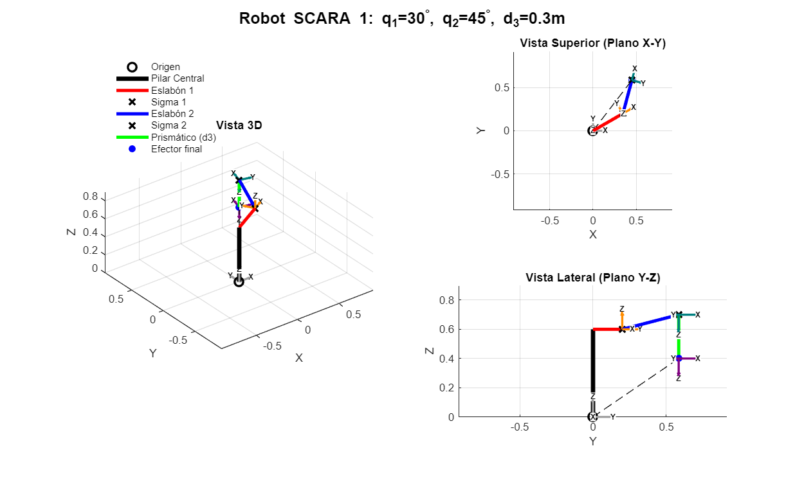
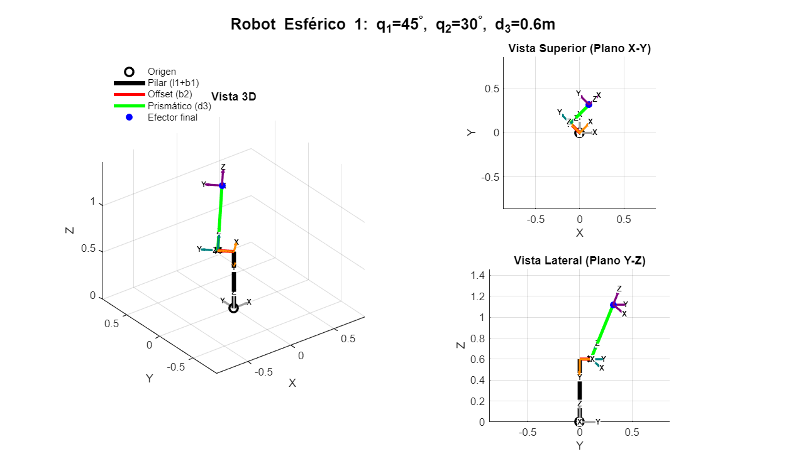
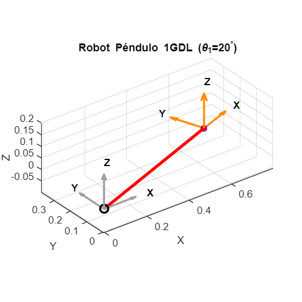

#  MATLAB Robotics Kinematics Toolbox

<div align="center">
  
  
  
</div>

<br>

## 📖 Description
A comprehensive and modular suite of MATLAB scripts and Live Scripts (`.mlx`) for modeling, simulating, and analyzing the kinematics of classic industrial robotic manipulators. 

This repository focuses on the geometric and analytical description of robot motion, establishing spatial relationships between links prior to dynamic analysis. It includes custom core libraries for **Homogeneous Transformations** and 3D visualization, offering complete solutions for **Forward Kinematics**, **Inverse Kinematics**, and **Differential Kinematics (Jacobian Matrices and Singularities)**.

<div align="center">
  
</div>

## 🧮 Theoretical Foundation: Denavit-Hartenberg (DH)

The Forward Kinematics models in this repository are systematically built using the **Denavit-Hartenberg (DH)** convention. The spatial transformation between consecutive reference frames is defined by four fundamental parameters ($\theta_i, d_i, a_i, \alpha_i$), executed in the following order:

$$H_{i-1}^i = R_z(\theta_i) T_z(d_i) T_x(a_i) R_x(\alpha_i)$$

Where:
* $R_z(\theta_i)$: Rotation around the Z-axis (Joint angle / variable for revolute joints).
* $T_z(d_i)$: Translation along the Z-axis (Link offset / variable for prismatic joints).
* $T_x(a_i)$: Translation along the X-axis (Link length).
* $R_x(\alpha_i)$: Rotation around the X-axis (Link twist).

### 🦾 How DH Matrices are Built for Each Robot

1. **SCARA Robot (RRP):**
   * **Kinematics:** Features two revolute joints and one prismatic joint. 
   * **Matrix Assembly:** The total transformation is $H_0^3 = H_0^1(q_1) \cdot H_1^2(q_2) \cdot H_2^3(d_3)$. It is selectively compliant in the horizontal plane (X-Y) and completely rigid in the vertical axis (Z).
   * **Singularities:** Determinant of the Jacobian shows singularities typically occur at the workspace boundaries when principal links fully align.

2. **Spherical Robot (RRP):**
   * **Kinematics:** Combines two intersecting rotational axes with a linear extension, operating naturally in polar coordinates.
   * **Matrix Assembly:** The first frame pitches, the second yaws, and the third extends $H_0^3 = H_0^1(q_1) \cdot H_1^2(q_2) \cdot H_2^3(d_3)$. 
   * **Characteristics:** Generates a spherical workspace, ideal for pivoting heavy machinery from a central base.

3. **Anthropomorphic Robot (3 DOF - RRR):**
   * **Kinematics:** Uses three revolute joints to mimic a human arm.
   * **Matrix Assembly:** Three consecutive rotations $H_0^3 = H_0^1(q_1) \cdot H_1^2(q_2) \cdot H_2^3(q_3)$. 
   * **Characteristics:** Expands the operational workspace exponentially. Inverse kinematics presents strong non-linear equations with multiple geometric solutions ("elbow up" vs "elbow down") for a single Cartesian point.

4. **Planar Robot (2 DOF - RR) & Inverted Pendulum:**
   * **Kinematics:** Two revolute joints restricted to a single 2D plane. Fundamentals for understanding joint-space to Cartesian-space mapping.

## ⚙️ How the Code Works (Architecture & Tweaking)

The mathematical models are developed in two main phases within the Live Scripts (`.mlx`):

**1. Symbolic Analysis (`syms`)**
The code initializes symbolic variables (e.g., `syms q1 q2 q3 l1 l2 l3 real`) to compute exact homogeneous transformation matrices without floating-point errors. The Jacobian matrix ($J$) is derived symbolically using $J = \frac{\partial f(q)}{\partial q}$, and its determinant is extracted to analytically pinpoint the robot's geometric singularities.

**2. Numerical Evaluation & Visualization**
To simulate physical states, the symbolic variables are substituted with physical parameters using `subs()` and evaluated with `double()`. 
* **Customizing parameters:** You can easily tweak link lengths (e.g., `r1_l1 = 0.5;`) or joint angles (e.g., `r1_q1 = deg2rad(25);`) in the *Numerical Evaluation* blocks to see how the robot reacts.
* **Custom Plotting:** The repository features a custom `drawFrame.m` and `plotRobot` function that dynamically scales the 3D workspace and utilizes `quiver3` to accurately plot the reference frames at each joint.

## 📸 Visual Previews

Here is a glimpse of the 3D models generated by the custom visualization engine:

<div align="center">
  <table>
    <tr>
      <td align="center"><b>Anthropomorphic 3-DOF</b><br></td>
      <td align="center"><b>SCARA Robot</b><br></td>
    </tr>
    <tr>
      <td align="center"><b>Spherical Robot</b><br></td>
      <td align="center"><b>Planar 2-DOF Pendulum</b><br></td>
    </tr>
  </table>
</div>

## 📁 Repository Structure

```text
MATLAB-Robotics-Kinematics/
│
├── docs/                      # Documentation and visual assets
│   ├── images/                # 3D plots (3dof.png, scara.png, etc.)
│   └── reports/               # In-depth PDF reports containing math proofs
│
├── lib/                       # Core kinematics library
│   ├── transforms/            # Basic rotations (Rx.m, Ry.m) and Homogeneous (Htx.m, Hrx.m, etc.)
│   └── visualization/         # Custom 3D plotting functions (drawFrame.m)
│
├── robots/                    # Robot-specific models (Scripts & Live Scripts)
│   ├── anthropomorphic_3dof/  # Forward & Inverse Kinematics for 3-DOF RRR
│   ├── planar_2dof_pendulum/  # Forward & Inverse Kinematics for 2-DOF Planar
│   ├── scara/                 # Forward & Inverse Kinematics for SCARA RRP
│   └── spherical/             # Forward & Inverse Kinematics for Spherical RRP
│
├── tests/                     # Validation scripts for transformation matrices
├── init_workspace.m           # Run this first! Adds /lib to MATLAB's path
└── README.md                  # This documentation file
```

## 🚀 Getting Started

1. Clone this repository to your local machine:
   ```bash
   git clone https://github.com/NablaCheese505/MATLAB-Robotics-Kinematics.git
   ```
2. Open MATLAB and navigate to the repository folder.
3. **CRITICAL:** Run the initialization script to load the custom libraries (`/lib`) into your MATLAB path:
   ```matlab
   init_workspace.m
   ```
4. Open any `.mlx` file inside the `/robots` directory and hit **Run** to explore the interactive simulations.

## 💻 Software Requirements
* **MATLAB** (R2020a or newer recommended)
* *Symbolic Math Toolbox* (Required for symbolic Jacobian and Denavit-Hartenberg calculations)

## ✨ Acknowledgments
A special and profound thanks to my robotics professor, **M.C. Berenice Sánchez Carreón**, for her outstanding guidance, patience, and teachings throughout this course.

## 👨‍💻 Author
**Martín Farid Carrasco Gómez** Mechatronics Engineering Student